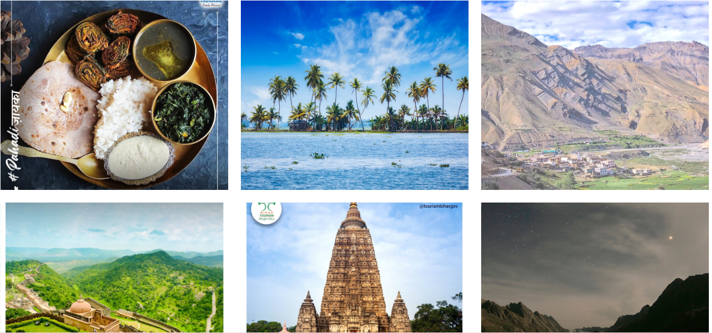

# Introduction:
India or Bharat: Hamara apna desh!

India is home to over a billion people, accommodating incredible cultural diversity between languages, geographic regions, religious traditions, and social stratifications. Indian culture promotes moral values and the attitudes of generosity, simplicity, and frugality. The diverse characters of India are strongly unified and perfectly assimilated to emerge as a one single nation.

We present to you our website, “Incredible India”. Incredible India Stands for the rich cultural heritage that we behold.

This website offers comprehensive information related to cultural heritage, ancient monuments, literary arts, visual arts, performing arts, fairs and festivals of India through images as well as text.

So come with us on this journey and explore the beautiful country that we call, India!
# Objectives:
India is well known for its rich and prosperous culture and heritage. The canvas of India’s culture is vast and has hues and vibrancy of all sorts. All the four corners of the nation are enriched by Paramount cultural diversity having its own peculiar and heart touching traditions.

Culture plays an important role in the development of any nation. It represents a set of shared attitudes, values, goals, and practices. Culture and creativity manifest themselves in almost all economic, social, and other activities. A country as diverse as India is symbolized by the plurality of its culture.

Despite this cultural diversity, still, there are many citizens who prefer to move overseas. But they should understand that there is hardly any culture in the whole world that is as enriched as Indian culture. Everything, from the culture and values of customs, rituals, and traditions, is ‘special’ in this ‘Land of Gods’.

As a result, our primary goal is to promote Indian culture and tradition, particularly among the country's youth, and to show them how India is indeed “Incredible” in every way.

# Tools and Technologies Used:
The website is developed using HTMLGoogle My Maps has been used to create a location picker that locates top heritage sites in India. The website is also responsive and can be viewed on different devices.

 # Implementation
Welcome to our website "Indian Culture"! This is the homepage of the website which shows the logo of the website, navigation bar, and brief introduction of the website.

This section of the website gives the user an overview of the famous heritage sites, and their great architecture and uniqueness in India.

### This section shows the different foods and cultures, heritage sites and the paradise of our country - India.
 
 

 Every state and city in India has it's own speciality. This section shows the Great cities of India and what are they famous for.

 # Contributorsgit
 

Made with [contrib.rocks](https://contrib.rocks).